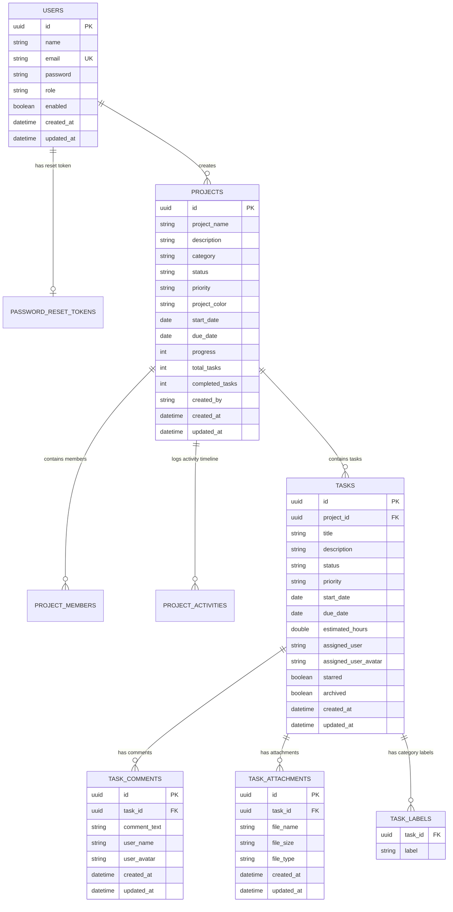

# FlowForge - Database Schema Documentation

FlowForge uses MySQL 8.x as its primary relational database. JPA and Hibernate handle ORM mappings.

---

## 📐 Entity Relationship (ER) Diagram



---

## 🗄️ Table Details

### 1. `users` Table
Stores user account profiles, hashed passwords, system roles, custom avatar URLs, security flags, appearance preferences, notification settings, and workspace metadata.

| Column | Type | Constraints | Description |
| :--- | :--- | :--- | :--- |
| `id` | `VARCHAR(36)` | `PRIMARY KEY` | UUID primary key |
| `name` | `VARCHAR(255)` | Not Null | User full display name |
| `email` | `VARCHAR(255)` | `UNIQUE`, Not Null | User email address |
| `password` | `VARCHAR(255)` | Not Null | BCrypt hashed password |
| `role` | `VARCHAR(50)` | Not Null, Default `'ROLE_USER'` | Security authority (`ROLE_USER`, `ROLE_ADMIN`) |
| `enabled` | `BOOLEAN` | Default `TRUE` | Account active flag |
| `last_login_at` | `DATETIME` | Nullable | Last login timestamp |
| `bio` | `VARCHAR(1000)` | Nullable | Personal bio text |
| `phone_number` | `VARCHAR(50)` | Nullable | Phone number |
| `designation` | `VARCHAR(100)` | Nullable | Job title / designation |
| `department` | `VARCHAR(100)` | Nullable | Department name |
| `location` | `VARCHAR(100)` | Nullable | Location / City |
| `profile_picture_url` | `LONGTEXT` | Nullable | Base64/URL avatar image stream |
| `theme_preference` | `VARCHAR(20)` | Default `'DARK'` | Theme mode (`DARK`, `LIGHT`, `SYSTEM`) |
| `accent_color` | `VARCHAR(20)` | Default `'ORANGE'` | Accent color (`ORANGE`, `EMERALD`, `PURPLE`, `ROSE`) |
| `workspace_name` | `VARCHAR(100)` | Default `'FlowForge Workspace'` | Workspace name |

---

### 2. `projects` Table
Stores workspace project repositories, progress percentages, task counters, cover colors, and dates.

---

### 3. `tasks` Table
Stores individual work items mapped to parent project repositories.

| Column | Type | Constraints | Description |
| :--- | :--- | :--- | :--- |
| `id` | `VARCHAR(36)` | `PRIMARY KEY`, Not Null | Generated UUID identifier |
| `project_id` | `VARCHAR(36)` | `FOREIGN KEY` -> `projects(id)`, Not Null | Parent project ID |
| `title` | `VARCHAR(255)` | Not Null | Task title |
| `description` | `VARCHAR(2000)` | Nullable | Task requirements & details |
| `status` | `VARCHAR(50)` | Not Null, Default `'TODO'` | Kanban column status (`BACKLOG`, `TODO`, `IN_PROGRESS`, `REVIEW`, `COMPLETED`) |
| `priority` | `VARCHAR(50)` | Not Null, Default `'MEDIUM'` | Task priority (`LOW`, `MEDIUM`, `HIGH`, `CRITICAL`) |
| `start_date` | `DATE` | Nullable | Scheduled start date |
| `due_date` | `DATE` | Nullable | Target due date |
| `estimated_hours` | `DOUBLE` | Default `8.0` | Estimated completion hours |
| `assigned_user` | `VARCHAR(255)` | Nullable | Assigned engineer name |
| `assigned_user_avatar` | `VARCHAR(50)` | Nullable | Avatar initial string (e.g. `'AC'`) |
| `starred` | `BOOLEAN` | Default `FALSE` | Favorite star flag |
| `archived` | `BOOLEAN` | Default `FALSE` | Archived state flag |
| `created_at` | `DATETIME` | Not Null | Creation timestamp |
| `updated_at` | `DATETIME` | Not Null | Last update timestamp |

#### Example SQL Record
```sql
INSERT INTO tasks (id, project_id, title, description, status, priority, start_date, due_date, estimated_hours, assigned_user, assigned_user_avatar, starred, archived, created_at, updated_at)
VALUES ('t1a2b3c4-5d6e-7f8a-9b0c-1d2e3f4a5b6c', 'b47c8d90-2e3f-4a5b-9c8d-7e6f5a4b3c2d', 'Build React Glassmorphism Kanban Drag & Drop Engine', 'Develop interactive Kanban Board supporting column transitions.', 'IN_PROGRESS', 'HIGH', '2026-07-18', '2026-07-25', 16.0, 'Elena Rostova', 'ER', 1, 0, '2026-07-18 14:30:00', '2026-07-22 23:30:00');
```

---

### 4. `notifications` Table
Stores real-time workspace alert notifications for project actions, task assignments, and member events.

| Column | Type | Constraints | Description |
| :--- | :--- | :--- | :--- |
| `id` | `VARCHAR(36)` | `PRIMARY KEY`, Not Null | Generated UUID identifier |
| `title` | `VARCHAR(255)` | Not Null | Short notification title |
| `message` | `VARCHAR(1000)` | Not Null | Detailed alert message |
| `icon` | `VARCHAR(50)` | Nullable | Lucide icon name (`'check-circle'`, `'alert-triangle'`) |
| `type` | `VARCHAR(50)` | Not Null | Notification event enum type |
| `priority` | `VARCHAR(20)` | Not Null | Priority urgency (`HIGH`, `MEDIUM`, `LOW`) |
| `read_status` | `BOOLEAN` | Not Null, Default `FALSE` | Read / Unread boolean flag |
| `sender` | `VARCHAR(255)` | Nullable | Sender user name or system entity |
| `receiver` | `VARCHAR(255)` | Not Null | Receiver user email address |
| `related_project` | `VARCHAR(255)` | Nullable | Related project name |
| `related_task` | `VARCHAR(255)` | Nullable | Related task title |
| `action_url` | `VARCHAR(255)` | Nullable | Client navigation URL |
| `created_at` | `DATETIME` | Not Null | Creation timestamp |
### 5. `audit_logs` Table
Stores security audit logs for system actions (logins, registrations, role promotions, settings updates).

| Column | Type | Constraints | Description |
| :--- | :--- | :--- | :--- |
| `id` | `VARCHAR(36)` | `PRIMARY KEY`, Not Null | Generated UUID identifier |
| `user_email` | `VARCHAR(255)` | Not Null | User email performing the action |
| `action` | `VARCHAR(255)` | Not Null | Audit action description |
| `module` | `VARCHAR(50)` | Not Null | Category (`AUTH`, `PROJECTS`, `TASKS`, `ADMIN`, `SETTINGS`) |
| `ip_address` | `VARCHAR(50)` | Nullable | IP address |
### 6. `chat_messages` Table
Stores persistent team chat messages for Workspace, Project Channels, and Private Direct Messages.

| Column | Type | Constraints | Description |
| :--- | :--- | :--- | :--- |
| `id` | `VARCHAR(36)` | `PRIMARY KEY`, Not Null | Generated UUID identifier |
| `sender_email` | `VARCHAR(255)` | Not Null | Sender email address |
| `sender_name` | `VARCHAR(255)` | Not Null | Sender display name |
| `sender_avatar` | `VARCHAR(255)` | Nullable | Sender avatar string or image URL |
| `recipient_email` | `VARCHAR(255)` | Nullable | Recipient email address (for DIRECT DM channels) |
| `project_id` | `VARCHAR(36)` | Nullable | Associated project ID (for PROJECT channels) |
| `channel_type` | `VARCHAR(50)` | Not Null, Default `'WORKSPACE'` | Channel scope (`WORKSPACE`, `PROJECT`, `DIRECT`) |
| `content` | `VARCHAR(4000)` | Not Null | Message text content |
| `attachment_url` | `LONGTEXT` | Nullable | Base64 file or image attachment URL |
| `reply_to_id` | `VARCHAR(36)` | Nullable | Parent message ID for thread replies |
| `edited` | `BOOLEAN` | Default `FALSE` | Edited flag |
| `pinned` | `BOOLEAN` | Default `FALSE` | Pinned flag |
### 7. `unified_comments` Table
Stores comments and nested replies for Projects, Tasks, and Attachments.

| Column | Type | Constraints | Description |
| :--- | :--- | :--- | :--- |
| `id` | `VARCHAR(36)` | `PRIMARY KEY`, Not Null | Generated UUID identifier |
| `target_type` | `VARCHAR(50)` | Not Null | Target entity (`PROJECT`, `TASK`, `ATTACHMENT`) |
| `target_id` | `VARCHAR(36)` | Not Null | Target identifier string |
| `parent_comment_id` | `VARCHAR(36)` | Nullable | Parent comment ID for nested replies |
| `author_email` | `VARCHAR(255)` | Not Null | Author email address |
| `author_name` | `VARCHAR(255)` | Not Null | Author display name |
| `author_avatar` | `VARCHAR(255)` | Nullable | Author avatar URL |
| `content` | `VARCHAR(4000)` | Not Null | Comment content |
| `edited` | `BOOLEAN` | Default `FALSE` | Edited flag |
| `deleted` | `BOOLEAN` | Default `FALSE` | Deleted flag |
| `created_at` | `DATETIME` | Not Null | Creation timestamp |

---

### 8. `file_attachments` Table
Stores file metadata and Base64 content for file management.

| Column | Type | Constraints | Description |
| :--- | :--- | :--- | :--- |
| `id` | `VARCHAR(36)` | `PRIMARY KEY`, Not Null | Generated UUID identifier |
| `file_name` | `VARCHAR(255)` | Not Null | File display name |
| `file_size` | `VARCHAR(50)` | Not Null | Human readable size (e.g. "2.4 MB") |
| `size_bytes` | `BIGINT` | Nullable | Raw byte count size |
| `file_type` | `VARCHAR(100)` | Not Null | MIME type |
| `target_type` | `VARCHAR(50)` | Not Null | Target entity type (`PROJECT`, `TASK`, `COMMENT`) |
| `target_id` | `VARCHAR(36)` | Not Null | Target entity ID |
| `uploaded_by` | `VARCHAR(255)` | Not Null | Uploader email |
| `file_data` | `LONGTEXT` | Not Null | Base64 file stream |
| `thumbnail_url` | `LONGTEXT` | Nullable | Image preview thumbnail Base64 stream |
| `created_at` | `DATETIME` | Not Null | Creation timestamp |

---

### 9. Database Query Performance & Indexing Strategy
To avoid N+1 query overhead and optimize pagination/sorting performance in production:
- **Foreign Key Indexes**: Key query columns (`created_by`, `assigned_user`, `project_id`, `recipient_email`, `target_id`, `author_email`) are indexed for fast lookup joins.
- **HikariCP Connection Pool**: Configured with `maximum-pool-size=20`, `minimum-idle=5`, and `idle-timeout=300000ms` in `application-prod.properties`.
- **Eager vs Lazy Loading**: `@ManyToOne` and `@OneToMany` entity relationships explicitly configured with `FetchType.LAZY` to prevent unintended join cascades on list queries.


